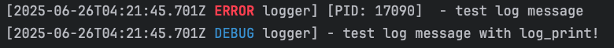

# rust simple logger

A minimal implementation of a Rust logger.

## 特性说明

- Logs are printed to stderr
- Supports logging without initializing the logging framework (using log_print!)
- Supports inserting custom information in the middle of logs
- Supports configuring whether log levels are displayed in color through features

